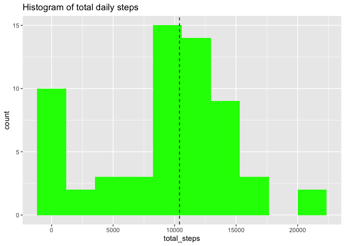
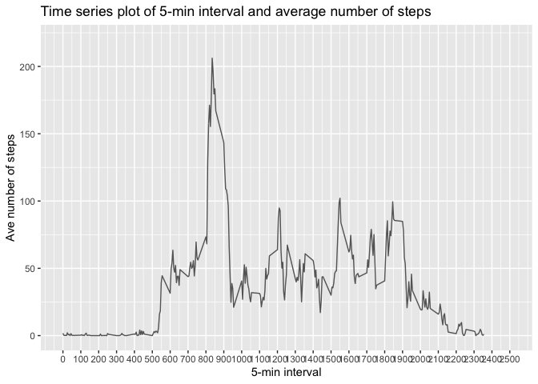
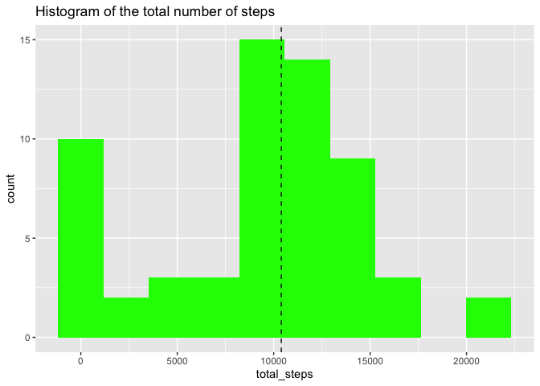
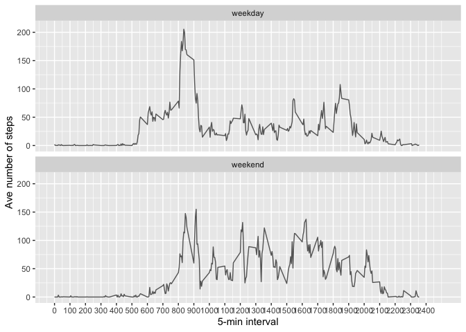

```r
knitr::opts_chunk$set(echo = TRUE)
```

## Introduction

This assignment makes use of data from a personal activity monitoring device. This device collects data at 5 minute intervals through out the day. The data consists of two months of data from an anonymous individual collected during the months of October and November, 2012 and include the number of steps taken in 5 minute intervals each day.

## Data

The data for this assignment can be downloaded from the course web site:
* Dataset: Activity monitoring data

The variables included in this dataset are:
* steps: Number of steps taking in a 5-minute interval (missing values are coded as NA)
* date: The date on which the measurement was taken in YYYY-MM-DD format
* interval: Identifier for the 5-minute interval in which measurement was taken

The dataset is stored in a comma-separated-value (CSV) file and there are a total of 17,568 observations in this dataset.


## Loading and preprocessing data 

```r
#data has been downloaded and copied on the working directory
# read data
activity <- read.table("activity.csv", header=TRUE, stringsAsFactors = F, sep = ",")
# convert date to date format
activity$date <- as.Date(activity$date, format = "%Y-%m-%d")
```

## What is mean total number of steps taken per day?

For this part of the assignment, you can ignore the missing values in the dataset.

### Make a histogram of the total number of steps taken each day


```r
# aggregate number of steps by day
daily_steps <- activity %>% 
    group_by(date) %>% 
    summarise(total_steps = sum(steps, na.rm=T))

# plot histogram of total daily steps
ggplot(daily_steps, aes(total_steps)) + geom_histogram(bins = 10, fill="green") + geom_vline(aes(xintercept = median(total_steps)), linetype=2) +
labs(title = "Histogram of total daily steps")  
```

<!-- -->

### Calculate and report the mean and median total number of steps taken per day


```r
avg_steps <- activity %>% 
    group_by(date) %>% 
    summarise(avg_steps = mean(steps, na.rm=TRUE)) 

# Print average number of steps per day
avg_steps
```

```
## # A tibble: 61 x 2
##    date       avg_steps
##    <date>         <dbl>
##  1 2012-10-01   NaN    
##  2 2012-10-02     0.438
##  3 2012-10-03    39.4  
##  4 2012-10-04    42.1  
##  5 2012-10-05    46.2  
##  6 2012-10-06    53.5  
##  7 2012-10-07    38.2  
##  8 2012-10-08   NaN    
##  9 2012-10-09    44.5  
## 10 2012-10-10    34.4  
## # … with 51 more rows
```

```r
median_steps <- activity %>% 
    group_by(date) %>% 
    summarise(median_steps = median(steps, na.rm=TRUE)) 

# Print median number of steps per day
median_steps
```

```
## # A tibble: 61 x 2
##    date       median_steps
##    <date>            <dbl>
##  1 2012-10-01           NA
##  2 2012-10-02            0
##  3 2012-10-03            0
##  4 2012-10-04            0
##  5 2012-10-05            0
##  6 2012-10-06            0
##  7 2012-10-07            0
##  8 2012-10-08           NA
##  9 2012-10-09            0
## 10 2012-10-10            0
## # … with 51 more rows
```

## What is the average daily activity pattern?

Make a time series plot (i.e. type = "l") of the 5-minute interval (x-axis) and the average number of steps taken, averaged across all days (y-axis)


```r
# first calculate average steps by interval across all dates
int_avg_steps <- activity %>% 
      group_by(interval) %>% 
      summarise(int_avg_steps = mean(steps, na.rm=TRUE)) 

ggplot(data=int_avg_steps,aes(x=interval, y=int_avg_steps)) + 
    xlab("5-min interval") + 
    scale_x_continuous(limits=c(0,2500),breaks=seq(0,2500,100)) +
    ylab("Ave number of steps") + 
    scale_y_continuous(limits=c(0,220),breaks=seq(0,220,50)) +
    geom_line(size=0.5,color='grey40') +
    labs(title = "Time series plot of 5-min interval and average number of steps")
```

<!-- -->

Which 5-minute interval, on average across all the days in the dataset, contains the maximum number of steps?

```r
int_avg_steps$interval[int_avg_steps$int_avg_steps == max(int_avg_steps$int_avg_steps)]
```

```
## [1] 835
```
##### The 5-minute interval with the maximum number of steps is the 835th interval.

## Imputing missing values

Calculate and report the total number of missing values in the dataset (i.e. the total number of rows with NAs)

```r
summary(activity)
```

```
##      steps             date               interval     
##  Min.   :  0.00   Min.   :2012-10-01   Min.   :   0.0  
##  1st Qu.:  0.00   1st Qu.:2012-10-16   1st Qu.: 588.8  
##  Median :  0.00   Median :2012-10-31   Median :1177.5  
##  Mean   : 37.38   Mean   :2012-10-31   Mean   :1177.5  
##  3rd Qu.: 12.00   3rd Qu.:2012-11-15   3rd Qu.:1766.2  
##  Max.   :806.00   Max.   :2012-11-30   Max.   :2355.0  
##  NA's   :2304
```
##### There are 2304 missing values in the activity dataset.


Devise a strategy for filling in all of the missing values in the dataset. The strategy does not need to be sophisticated. For example, you could use the mean/median for that day, or the mean for that 5-minute interval, etc.


```r
# first calculate median steps by interval across all dates to replace missing values
int_med_steps <- activity %>% 
      group_by(interval) %>% 
      summarise(med_steps = median(steps, na.rm=TRUE)) 
# impute missing steps using the median steps for the 5min interval
new_data <- activity %>%
      left_join(int_med_steps, by = "interval" ) %>%
      mutate(steps_filld = ifelse(is.na(steps), med_steps, steps)) %>%
      select(steps_filld, date, interval)

summary(new_data)
```

```
##   steps_filld       date               interval     
##  Min.   :  0   Min.   :2012-10-01   Min.   :   0.0  
##  1st Qu.:  0   1st Qu.:2012-10-16   1st Qu.: 588.8  
##  Median :  0   Median :2012-10-31   Median :1177.5  
##  Mean   : 33   Mean   :2012-10-31   Mean   :1177.5  
##  3rd Qu.:  8   3rd Qu.:2012-11-15   3rd Qu.:1766.2  
##  Max.   :806   Max.   :2012-11-30   Max.   :2355.0
```

Create a new dataset of total daily steps that is equal to the original dataset but with the missing data filled in.

```r
new_daily_steps <- new_data %>% 
    group_by(date) %>% 
    summarise(total_steps = sum(steps_filld, na.rm=TRUE)) 
```

Make a histogram of the total number of steps taken each day 

```r
ggplot(new_daily_steps, aes(total_steps)) + 
  geom_histogram(bins = 10, fill="green") + 
  geom_vline(aes(xintercept = median(total_steps)), linetype=2) +
  labs(title = "Histogram of the total number of steps")
```

<!-- -->

Calculate and report the mean and median total number of steps taken per day. 


```r
new_daily_avg <- new_data %>% 
      group_by(date) %>% 
      summarise(daily_avg_steps =mean(steps_filld))

new_daily_avg
```

```
## # A tibble: 61 x 2
##    date       daily_avg_steps
##    <date>               <dbl>
##  1 2012-10-01           3.96 
##  2 2012-10-02           0.438
##  3 2012-10-03          39.4  
##  4 2012-10-04          42.1  
##  5 2012-10-05          46.2  
##  6 2012-10-06          53.5  
##  7 2012-10-07          38.2  
##  8 2012-10-08           3.96 
##  9 2012-10-09          44.5  
## 10 2012-10-10          34.4  
## # … with 51 more rows
```

```r
new_daily_median <- new_data %>% 
      group_by(date) %>% 
      summarise(daily_mdn_steps = median(steps_filld))

new_daily_median
```

```
## # A tibble: 61 x 2
##    date       daily_mdn_steps
##    <date>               <dbl>
##  1 2012-10-01               0
##  2 2012-10-02               0
##  3 2012-10-03               0
##  4 2012-10-04               0
##  5 2012-10-05               0
##  6 2012-10-06               0
##  7 2012-10-07               0
##  8 2012-10-08               0
##  9 2012-10-09               0
## 10 2012-10-10               0
## # … with 51 more rows
```

Do these values differ from the estimates from the first part of the assignment? ###### The average and median daily steps remain the same.

What is the impact of imputing missing data on the estimates of the total daily number of steps?
##### Aside from filling up the dates with missing value, there's hardly no impact seen on imputing the missing data.

## Are there differences in activity patterns between weekdays and weekends?

Create a new factor variable in the dataset with two levels -- "weekday" and "weekend" indicating whether a given date is a weekday or weekend day.

```r
new_df <- new_data %>% 
    mutate(dayweek = ifelse(weekdays(date) %in% c("Saturday", "Sunday"), "weekend", "weekday")) %>% 
    group_by(dayweek, interval) %>%
  summarise(intavg_steps = mean(steps_filld))
```

Make a panel plot containing a time series plot (i.e. type = "l") of the 5-minute interval (x-axis) and the average number of steps taken, averaged across all weekday days or weekend days (y-axis). 


```r
ggplot(data=new_df,aes(x=interval, y=intavg_steps)) + 
  xlab("5-min interval") + 
  scale_x_continuous(limits=c(0,2500),breaks=seq(0,2400,100)) +
  ylab("Ave number of steps") + 
  scale_y_continuous(limits=c(0,210),breaks=seq(0,220,50)) +
  geom_line(size=0.5,color='grey40') +
  facet_wrap(~dayweek, ncol=1)
```

<!-- -->
